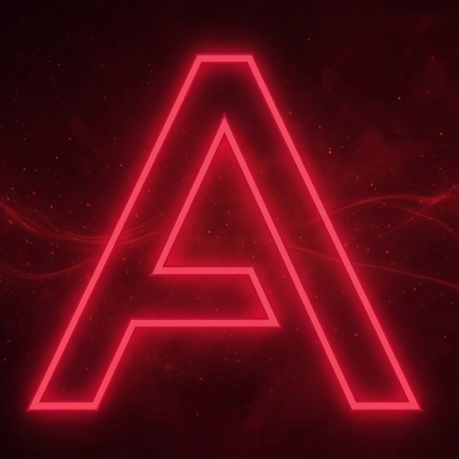

<div align="center">



# LM Local

### Easy-to-use local AI text and image generation, optimized for mobile devices

**Chat. Generate images. Use tools. See. Listen. All on your phone or Mac. All offline. Zero data leaves your device.**

[](https://github.com/Alan12O/Lm-Local/actions/workflows/ci.yml)
[](https://codecov.io/gh/Alan12O/Lm-Local)
[](https://opensource.org/licenses/MIT)

[Leer en Español 🇪🇸](README.es.md)

</div>

---

## 🚀 Not just another chat app

Most "local LLM" apps give you a text chatbot and call it a day. **LM Local** is a **complete offline AI suite** — text generation, image generation, vision AI, voice transcription, tool calling, and document analysis, all running natively on your phone's or Mac's hardware.

---

## ✨ Key Features

<div align="center">
<table>
  <tr>
    <td align="center"><b>💬 Text Generation</b><br/>Llama 3.2, Qwen 3, Phi-4<br/>Streaming & Thinking Mode</td>
    <td align="center"><b>🎨 Image Generation</b><br/>Stable Diffusion NPU-Accelerated<br/>Real-time previews</td>
    <td align="center"><b>👁️ Vision AI</b><br/>Analyze images & documents<br/>SmolVLM & Qwen3-VL</td>
  </tr>
  <tr>
    <td align="center"><b>🛠️ Tool Calling</b><br/>Web Search, Calculator<br/>Knowledge Base Integration</td>
    <td align="center"><b>📚 Local RAG</b><br/>On-device vector search<br/>PDF & Doc analysis</td>
    <td align="center"><b>🎙️ Voice Input</b><br/>Whisper STT<br/>Zero-latency transcription</td>
  </tr>
</table>
</div>

### 🧠 Advanced Capabilities

- **Project Knowledge Base** — Upload PDFs and text documents. They are chunked, embedded on-device with MiniLM, and retrieved via cosine similarity using a local SQLite vector store.
- **Remote LLM Support** — Seamlessly connect to Ollama, LM Studio, or any OpenAI-compatible API on your local network with automatic discovery.
- **Hardware Acceleration** — Forcibly stable NPU utilization on Snapdragon (8 Gen 2/3) and Core ML on Apple Silicon.
- **Privacy First** — No trackers, no analytics, no cloud. Your data is yours.

---

## 📦 Installation

### Download
Download from the active releases list.
Note: Android packages are signed with **Alan12O's** key.
Note: iOS packages are signed with **Alan12O's** key.
Note: Currently, there is no easy way to distribute the app on iOS beyond betas. We recommend building directly from source.

### Build from source
There are different ways to install and use this app.
The easiest way is to build from source code.
An internal script is provided to facilitate the process: `./correr_compilacion.ps1`, which will ask you what type of build you want to perform and handle the installation of requirements (where possible).
To use the scripts locally, you will need Node.js 20+, JDK 17, Android SDK 35/36, and Xcode 15+.
Note: for iOS, you also need to have CocoaPods installed; currently, it is not included in the auto-setup script.

```bash
git clone https://github.com/Alan12O/Lm-Local.git
cd Lm-Local
npm install

# Build for Android
npm run android

# Build for iOS
cd ios && pod install && cd ..
npm run ios
```

---

## 🛠️ Testing & Quality

We maintain strict quality gates via **Husky** and **GitHub Actions**. Every PR is validated against:

- **Unit Tests** (`Jest`): Logic, stores, and service layers.
- **Native Tests** (`JUnit`/`XCTest`): Hardware-specific modules (NPU, PDF, File System).
- **E2E Flows** (`Maestro`): Critical user paths.

```bash
npm test              # Run all unit/native tests
npm run test:e2e      # Run Maestro E2E flows
```

---

## 📖 Documentation

Explore our detailed guides:

- 🏛️ **[Architecture](docs/ARCHITECTURE.md)**: System design and performance tuning.
- 🗺️ **[Codebase Guide](docs/standards/CODEBASE_GUIDE.md)**: Deep dive into the source code.
- 🎨 **[Design System](docs/design/DESIGN_PHILOSOPHY_SYSTEM.md)**: Brutalist aesthetics and theme engine.
- ⚖️ **[Privacy Policy](docs/PRIVACY_POLICY.md)**: Our commitment to your data.

---

## 📜 Credits & Acknowledgments

This application is based on the original work of **Wednesday** and the **Off Grid** application. We are grateful for their contributions to the local AI ecosystem.

---

<div align="center">
Built by Alan12O based on Wednesday's work (from Off Grid).
</div>
